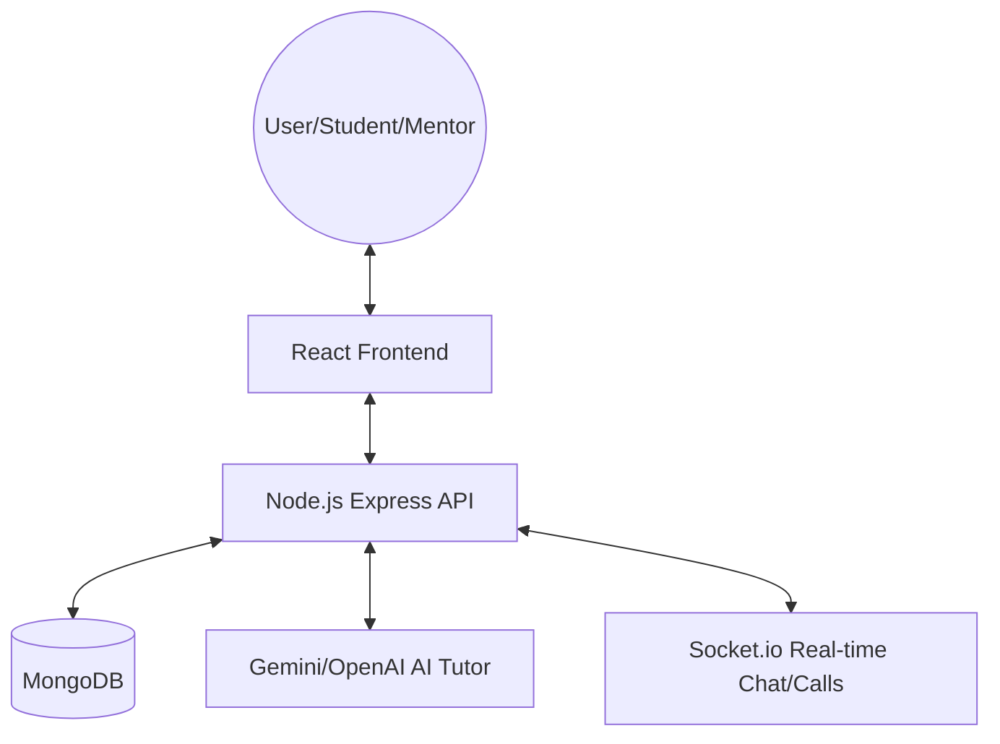

# FINAL YEAR PROJECT DOCUMENTATION

## 🎓 Smart Education Platform
**Transforming Learning with AI & Community**

---

### 📘 Abstract
The **Smart Education Platform** is a comprehensive, MERN-stack based educational ecosystem designed to bridge the gap between students, mentors, and counselors. By integrating advanced AI (Gemini/OpenAI), the platform provides personalized tutoring, while its community and mentorship features foster a collaborative learning environment. The addition of a specialized Mental Health support module ensures the well-being of students, making it a holistic solution for modern education.

---

### 🛠️ Technical Stack
- **Frontend**: React 19, Vite, TailwindCSS, Framer Motion
- **Backend**: Node.js, Express.js
- **Database**: MongoDB (Atlas)
- **Real-time Communication**: Socket.io
- **AI Integration**: Google Gemini API / OpenAI API
- **Authentication**: JWT (JSON Web Tokens) with Secure Cookie-based storage
- **UI Components**: Custom Vanilla CSS + Tailwind utilities

---

### 🗺️ System Architecture



---

### 📦 Key Modules & Features

#### 1. 🤖 AI Tutor & Assistant
An intelligent chatbot that helps students with academic queries, provides study materials, and explains complex concepts in real-time.

#### 2. 👨‍🏫 Mentorship Directory
A specialized platform for discovering and connecting with industry experts and academic mentors.
- Mentor Search & Filtering
- Mentorship Requests & Tracking

#### 3. 💬 Community Forums
A collaborative space for students to participate in discussions, share resources, and ask questions.
- Peer-to-peer interaction
- Threaded discussions

#### 4. 🧠 Mental Health Support
A unique module providing counseling resources, mood tracking, and video call capabilities with counselors.
- Counselor Directory
- Real-time Video/Audio Consultations
- Mood Analytics

#### 5. 💼 Internship & Career Board
A dedicated board for students to find internships and career opportunities.
- Job Listings & Applications
- Company Profiles

---

### 📂 File Structure (Overview)

```
smart-education-platform/
├── client/              # React + Vite frontend
│   ├── src/
│   │   ├── components/  # Reusable UI components
│   │   ├── pages/       # Fully routed page components
│   │   ├── routes/      # App routing & Protected routes
│   │   └── services/    # API & AI service calls
├── server/              # Node.js + Express backend
│   ├── src/
│   │   ├── controllers/ # Business logic
│   │   ├── models/      # MongoDB Data Schemas
│   │   └── routes/      # API Endpoint definitions
```

---

### 💾 Database Schema (Core Models)
- **User**: Name, Email, Role, Profile Details
- **MentorProfile / StudentProfile / CounselorProfile**: Role-specific metadata
- **Post / Comment**: Forum data
- **MentorshipSession / CounselingSession**: Booking and session state
- **Internship / Application**: Job board data
- **AiChat**: Message history for the AI assistant

---

### 🚀 Conclusion
The Smart Education Platform successfully addresses the diverse needs of the modern student by combining academic support, professional networking, and mental health resources into a single, unified interface. Its robust architecture and AI integration make it a scalable and innovative solution for educational institutions.

---
*Documentation Generated on: 2026-03-21*
